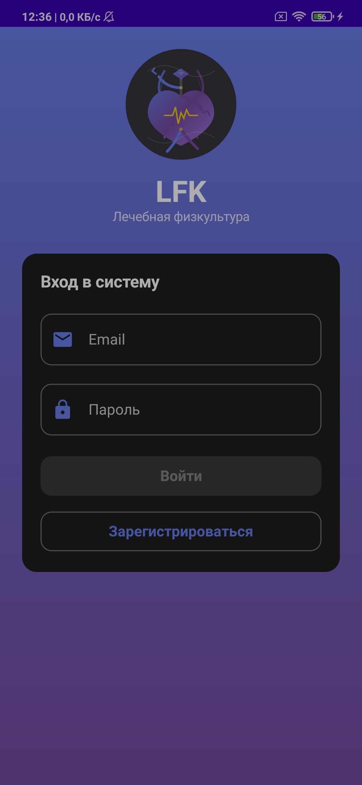
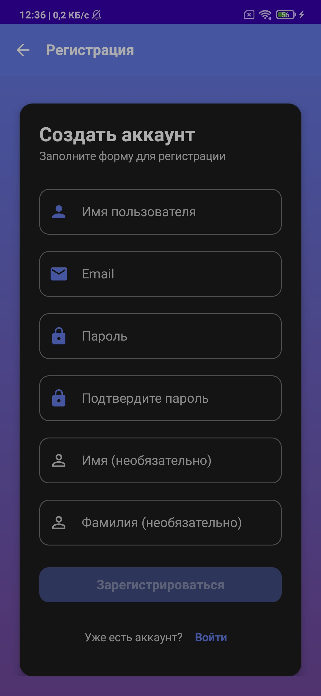
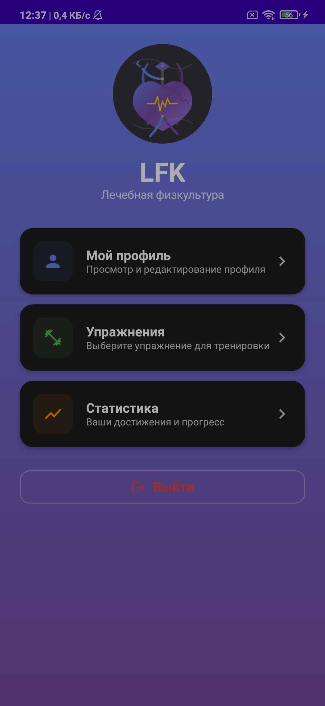
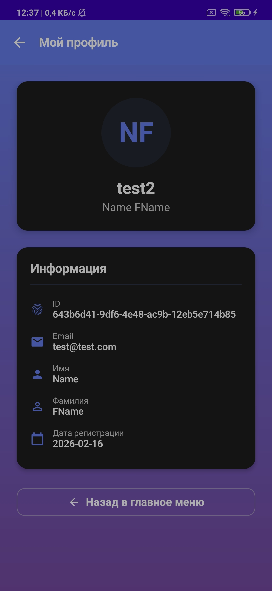
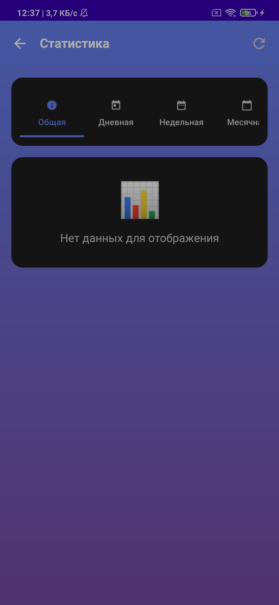
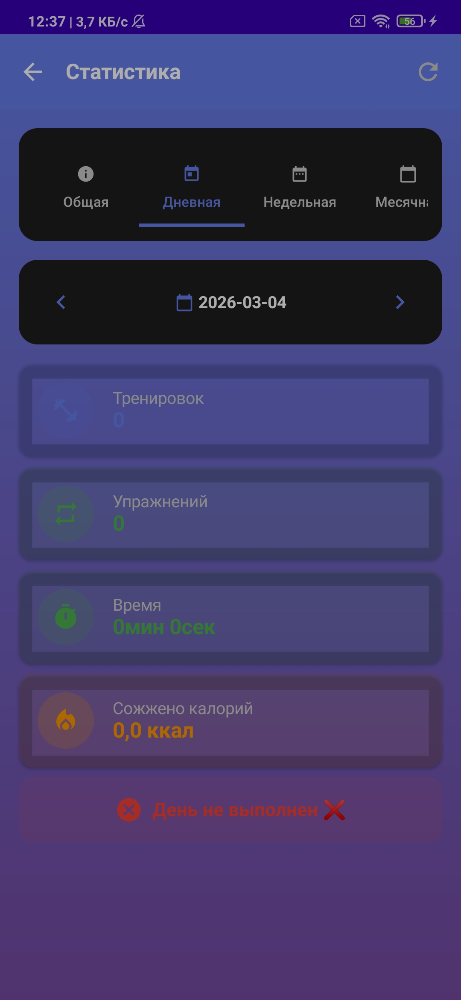
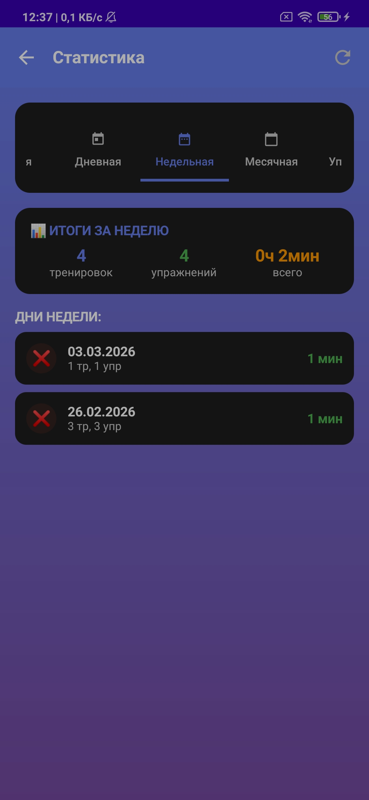
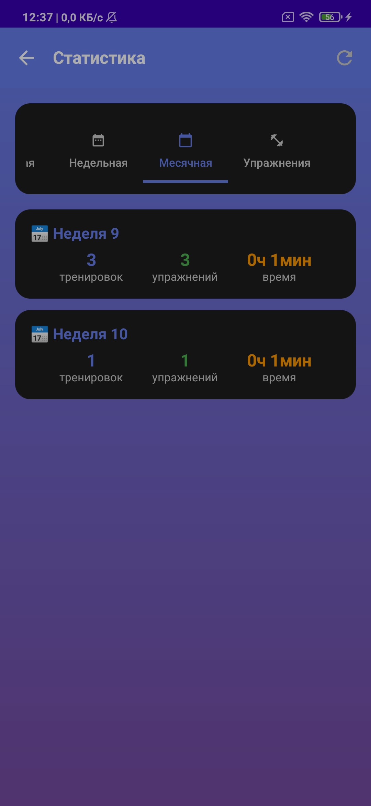
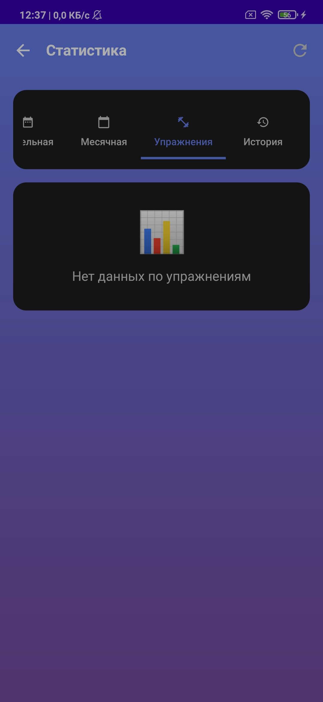

# Лечебная Физическая Культура (ЛФК) 🏥

<div align="center">
  
</div>

<div align="center">
  
  
  
  [](https://goreportcard.com/report/github.com/gitmonstera/lfk)
  
  
  
  
  *Умный помощник для выполнения упражнений лечебной физкультуры*
  
  [О проекте](#-о-проекте) •
  [Технологии](#-технологии) •
  [Быстрый старт](#-быстрый-старт) •
  [Архитектура](#-архитектура) •
  [API](#-api-endpoints) •
  [Разработчик](#-разработчик)
  
</div>

---

## 📋 О проекте

**LFK** — это интеллектуальная система, которая помогает людям правильно выполнять упражнения лечебной физкультуры (ЛФК). Проект использует компьютерное зрение для анализа движений в реальном времени, предоставляет обратную связь и отслеживает прогресс пользователя.

### ✨ Возможности
- 📹 **Анализ движений** в реальном времени через камеру
- 🗣️ **Голосовые и визуальные подсказки** при неправильном выполнении
- 📊 **Отслеживание прогресса** и детальная статистика тренировок
- 📱 **Мобильное приложение** для Android (Kotlin, Jetpack Compose)
- 🔄 **WebSocket соединение** для мгновенной обратной связи
- 🗄️ **PostgreSQL** для хранения истории тренировок
- ⚡ **Redis** для кэширования и очередей задач
- 🐳 **Docker & Kubernetes** для масштабирования
- 📈 **Метрики и мониторинг** производительности

---

## 📱 Интерфейс приложения

<div align="center">
  
### 🔐 Вход и регистрация

| Экран входа | Регистрация |
|:------------:|:-----------:|
|  |  |

### 🏠 Главное меню и профиль

| Главный экран | Профиль пользователя |
|:-------------:|:--------------------:|
|  |  |

### 📊 Статистика тренировок

| Общая статистика | Дневная статистика | Недельная статистика |
|:----------------:|:-------------------:|:--------------------:|
|  |  |  |

| По упражнениям | Прогресс | Детали |
|:--------------:|:--------:|:------:|
|  |  |  |

</div>

---

## 🛠 Технологии

<div align="center">
  
### Backend


### Computer Vision


### Mobile


### DevOps & Infrastructure


</div>

---

## 🚀 Быстрый старт

### Предварительные требования
- Go 1.21+
- Python 3.10+
- PostgreSQL 14+
- Redis 7+
- Docker & Docker Compose (опционально)
- Android Studio (для мобильной разработки)

### 🐳 Быстрый запуск через Docker Compose

```bash
# Клонируйте репозиторий
git clone https://github.com/gitmonstera/lfk.git
cd lfk

# Запустите все сервисы
docker-compose up -d

# Проверьте статус
docker-compose ps
```

### 🔧 Ручная установка

#### 1️⃣ Настройка базы данных

```bash
# Создайте базу данных
sudo -u postgres psql
CREATE DATABASE lfkdg;
\q

# Примените миграции
psql -d lfkdg -f database/migrations.sql
```

#### 2️⃣ Настройка Redis

```bash
# Установка Redis
sudo apt update
sudo apt install redis-server

# Запуск Redis
sudo systemctl start redis-server
sudo systemctl enable redis-server

# Проверка что Redis работает
sudo systemctl status redis-server
redis-cli ping  # Должно вернуть: PONG
```

#### 3️⃣ Настройка конфигурации

```bash
# Скопируйте пример конфигурации
cp configs/config.example.yaml configs/config.yaml

# Отредактируйте под свои параметры
nano configs/config.yaml
```

#### 4️⃣ Запуск Go сервера

```bash
cd backend/cmd
go mod download
go run main.go
```
Сервер запустится на `http://localhost:8080`

#### 5️⃣ Запуск Python процессора

```bash
cd backend/python_processor

# Создание виртуального окружения
python3 -m venv venv
source venv/bin/activate  # для Linux/Mac

# Установка зависимостей
pip install -r requirements.txt

# Запуск процессора
python exercise_detector.py
```
Python сервер запустится на `http://localhost:5000`

#### 6️⃣ Запуск тестового клиента

```bash
# В новом терминале
cd backend/python_processor/debug_frames
source ../venv/bin/activate
python test_client.py
```

---

## 🏗 Архитектура

<div align="center">

```
┌─────────────────┐     ┌─────────────────┐     ┌─────────────────┐
│   Mobile App    │────▶│   Go Backend    │────▶│  PostgreSQL     │
│   (Kotlin)      │◀────│   (REST/WS)     │◀────│   Database      │
└─────────────────┘     └────────┬────────┘     └─────────────────┘
                                 │
                                 ▼
                         ┌─────────────────┐     ┌─────────────────┐
                         │     Redis       │────▶│   Python CV     │
                         │   - Cache       │     │   Processors    │
                         │   - Pub/Sub     │     │   (MediaPipe)   │
                         │   - Queues      │     └─────────────────┘
                         └─────────────────┘
                                 │
                                 ▼
                         ┌─────────────────┐
                         │   WebSocket     │
                         │    Cluster      │
                         └─────────────────┘
```

</div>

### Ключевые компоненты

| Компонент | Назначение | Технологии |
|-----------|------------|------------|
| **API Gateway** | Маршрутизация запросов, аутентификация | Go, Gin, JWT |
| **WebSocket Hub** | Управление WebSocket соединениями | Go, Gorilla WebSocket |
| **Redis Cluster** | Кэширование, очереди, Pub/Sub | Redis, Redis Cluster |
| **CV Processor** | Анализ видео через камеру | Python, MediaPipe, OpenCV |
| **Database** | Хранение данных пользователей | PostgreSQL |
| **Metrics** | Мониторинг производительности | Prometheus, Grafana |

---

## 📁 Структура проекта

```
📦 LFK
├── 📂 backend/                          # Основной бэкенд на Go
│   ├── 📂 cmd/
│   │   └── 📄 main.go                    # Точка входа
│   ├── 📂 internal/
│   │   ├── 📂 auth/                      # JWT аутентификация
│   │   ├── 📂 handlers/                   # HTTP обработчики
│   │   ├── 📂 middleware/                  # Промежуточное ПО
│   │   ├── 📂 models/                      # Модели данных
│   │   ├── 📂 repository/                   # Работа с БД
│   │   ├── 📂 websocket/                    # WebSocket хаб
│   │   │   ├── 📄 hub.go
│   │   │   └── 📄 cluster_hub.go           # Кластерный WebSocket
│   │   ├── 📂 redis/                        # Redis клиент
│   │   │   ├── 📄 client.go
│   │   │   ├── 📄 pubsub.go
│   │   │   └── 📄 queue.go
│   │   ├── 📂 processor/                    # Пул Python процессоров
│   │   │   └── 📄 pool.go
│   │   └── 📂 metrics/                      # Метрики и мониторинг
│   │       └── 📄 metrics.go
│   ├── 📂 pkg/
│   │   └── 📂 python_bridge/                # Клиент для Python
│   │       └── 📄 client.go
│   └── 📄 go.mod
│
├── 📂 python_processor/                  # Python модуль для CV
│   ├── 📂 exercises/
│   │   ├── 📄 base_exercise.py
│   │   ├── 📄 fist_exercise.py
│   │   ├── 📄 fist_index_exercise.py
│   │   └── 📄 fist_palm_exercise.py
│   └── 📄 exercise_detector.py
│
├── 📂 configs/                           # Конфигурационные файлы
│   ├── 📄 config.example.yaml
│   └── 📄 config.yaml
│
├── 📂 deployments/                        # Деплоймент
│   ├── 📂 docker/
│   │   ├── 📂 go/
│   │   │   └── 📄 Dockerfile
│   │   └── 📂 python/
│   │       └── 📄 Dockerfile
│   ├── 📂 kubernetes/
│   │   ├── 📄 go-deployment.yaml
│   │   ├── 📄 python-deployment.yaml
│   │   ├── 📄 redis-cluster.yaml
│   │   ├── 📄 postgres-cluster.yaml
│   │   └── 📂 nginx/
│   │       └── 📄 nginx.conf
│   └── 📄 docker-compose.yml
│
├── 📂 scripts/                           # Вспомогательные скрипты
│   ├── 📄 migrate.sh
│   └── 📄 seed.sh
│
├── 📂 mobile/                            # Android приложение
│   └── 📂 app/
│
├── 📂 docs/                               # Документация
│   └── 📄 API.md
│
└── 📄 README.md
```

---

## 🔌 API Endpoints

<details>
<summary>📋 Нажмите, чтобы развернуть полный список API</summary>

### Публичные маршруты
| Метод | Эндпоинт | Описание |
|--------|----------|----------|
| `POST` | `/api/register` | Регистрация нового пользователя |
| `POST` | `/api/login` | Вход в систему |
| `GET` | `/api/health` | Проверка статуса сервера |
| `GET` | `/api/user/check` | Проверка существования пользователя |
| `GET` | `/api/user/check/email` | Проверка доступности email |
| `GET` | `/api/user/check/username` | Проверка доступности username |

### Защищенные маршруты (JWT)

#### 👤 Профиль
| Метод | Эндпоинт | Описание |
|--------|----------|----------|
| `GET` | `/api/profile` | Получить профиль |
| `PUT` | `/api/profile` | Обновить профиль |
| `POST` | `/api/change-password` | Сменить пароль |

#### 🏋️ Упражнения
| Метод | Эндпоинт | Описание |
|--------|----------|----------|
| `GET` | `/api/exercises` | Список упражнений |
| `GET` | `/api/exercises/:id` | Упражнение по ID |
| `GET` | `/api/exercise_state` | Состояние упражнения |
| `POST` | `/api/exercise/reset` | Сброс упражнения |

#### 📝 Тренировки
| Метод | Эндпоинт | Описание |
|--------|----------|----------|
| `POST` | `/api/workout/start` | Начать тренировку |
| `POST` | `/api/workout/end` | Завершить тренировку |
| `GET` | `/api/workout/history` | История тренировок |
| `GET` | `/api/workout/current` | Текущая тренировка |

#### 📊 Статистика
| Метод | Эндпоинт | Описание |
|--------|----------|----------|
| `GET` | `/api/stats/overall` | Общая статистика |
| `GET` | `/api/stats/daily` | Статистика за день |
| `GET` | `/api/stats/weekly` | Статистика за неделю |
| `GET` | `/api/stats/monthly` | Статистика за месяц |
| `GET` | `/api/stats/exercises` | Статистика по упражнениям |

### 🔌 WebSocket
| Эндпоинт | Описание |
|----------|----------|
| `/ws/exercise/fist` | Упражнение "Кулак" |
| `/ws/exercise/fist-index` | "Кулак с указательным пальцем" |
| `/ws/exercise/fist-palm` | "Кулак-ладонь" |

</details>

---

## 📈 Производительность

- **WebSocket соединения**: до 10K одновременных подключений
- **Время отклика**: < 100ms (p99)
- **Пропускная способность**: 1000 RPS на инстанс
- **Доступность**: 99.9% при кластеризации
- **Масштабирование**: горизонтальное через Kubernetes

---

## 🤝 Как внести вклад

1. Форкните репозиторий
2. Создайте ветку (`git checkout -b feature/amazing-feature`)
3. Закоммитьте изменения (`git commit -m 'Add amazing feature'`)
4. Запушьте (`git push origin feature/amazing-feature`)
5. Откройте Pull Request

---

## 📄 Лицензия

Распространяется под лицензией MIT. Смотрите `LICENSE` для подробностей.

---

## 👥 Разработчик

- **Full-stack Developer** - [@gitmonstera](https://github.com/gitmonstera)
- 📧 **Email**: gitmonstera@example.com
- 🌐 **Website**: [https://gitmonstera.dev](https://gitmonstera.dev)

---

## ⭐ Благодарности

- Всем пользователям и контрибьюторам
- Команде MediaPipe за отличную библиотеку CV
- Open Source сообществу

---

<div align="center">

**⭐ Если проект вам полезен, поставьте звездочку! ⭐**

[⬆ Вернуться к началу](#лечебная-физическая-культура-лфк-)

</div>